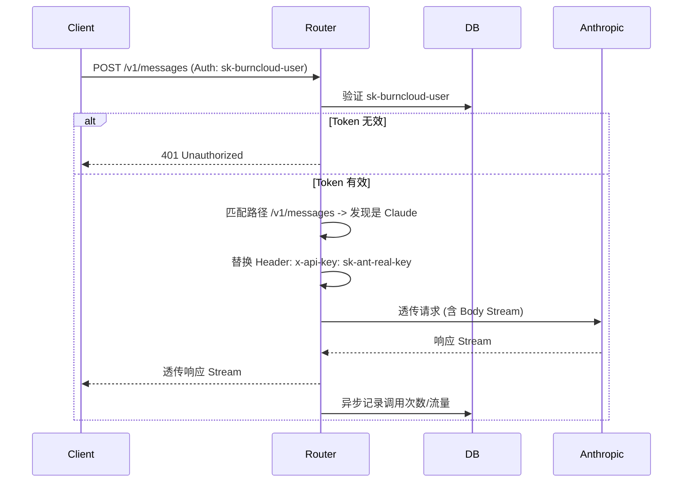

# BurnCloud Router - Project Plan

## 1. 项目愿景 (Vision)

**BurnCloud Router** 是一个高性能、轻量级的 LLM API 反向网关。
与传统的聚合网关（如 OneAPI）不同，**Router 的核心原则是 "Don't Touch the Body"（不修改包体）**。它不试图统一不同厂商的 API 格式，而是作为一个智能管道，负责鉴权、计费、路由分发，并将原始请求无损透传给上游服务商。

### 核心价值
*   **零延迟损耗**：不进行 JSON 解析/反序列化/重组，直接透传字节流。
*   **维护成本低**：上游厂商 API 变动无需修改网关代码。
*   **多协议兼容**：天然支持所有基于 HTTP 的 LLM 协议（OpenAI, Anthropic, Google, Azure 等）。

## 2. 核心功能 (Core Features)

1.  **智能路由 (Smart Routing)**
    *   基于请求路径（Path）自动识别目标厂商。
    *   例如：`/v1/messages` -> 转发至 Anthropic; `/v1beta/models` -> 转发至 Google Gemini。
2.  **统一鉴权 (Unified Auth)**
    *   客户端统一使用 `Bearer sk-burncloud-xxx` 进行访问。
    *   网关负责校验 Token 有效性。
3.  **密钥注入 (Key Injection)**
    *   网关剥离用户 Token，根据路由规则注入真实的厂商 API Key。
    *   支持处理不同厂商的 Header 要求（如 `x-api-key`, `api-key`, `Authorization`）。
4.  **流式透传 (Streaming Pass-through)**
    *   完美支持 SSE (Server-Sent Events) 流式响应，保持打字机效果。
5.  **基础计费 (Basic Accounting)**
    *   基于“请求次数”或“流量大小”进行统计。
    *   *注：由于不解析 Body，暂不支持精确的 Token 数量统计。*

## 3. 技术架构 (Architecture)

### 目录结构
位于 Monorepo 的 `crates/router` 目录下。

### 技术栈
*   **Language**: Rust (Edition 2021)
*   **Web Framework**: Axum (基于 Tokio，高性能异步 I/O)
*   **HTTP Client**: Reqwest (支持 Streaming Body)
*   **Database**: SQLx (SQLite) - 复用项目现有的数据库基础设施
*   **Error Handling**: Anyhow / Thiserror

### 数据模型 (Schema)

#### Upstream (上游渠道)
定义真实的 API 提供方。
*   `id`: UUID
*   `name`: 渠道名称 (e.g., "Claude Pro Account")
*   `base_url`: 厂商基地址 (e.g., `https://api.anthropic.com`)
*   `real_api_key`: 真实密钥 (加密存储)
*   `path_prefix`: 匹配路径前缀 (e.g., `/v1/messages`)
*   `header_type`: 鉴权头类型 (Enum: `Bearer`, `XApiKey`, `Azure`)

#### VirtualToken (虚拟令牌)
分发给用户的访问凭证。
*   `token`: string (sk-...)
*   `user_id`: 关联用户
*   `status`: Active / Disabled
*   `quota_limit`: 限额 (可选)

## 4. 路由逻辑 (Routing Strategy)

网关将采用 **最长前缀匹配 (Longest Prefix Match)** 策略：

1.  **接收请求**: `POST /v1/messages`
2.  **查找规则**: 遍历所有 Upstream 配置，寻找 `path_prefix` 匹配 `/v1/messages` 的记录。
3.  **决策**:
    *   命中 -> 获取对应的 `base_url` 和 `real_api_key`。
    *   未命中 -> 返回 404 或尝试默认渠道。
4.  **转发**:
    *   Target URL = `base_url` + `request_path` + `query_params`
    *   Headers = `Original Headers` - `Host` - `Authorization` + `Real Auth Header`

## 5. 交互流程图

