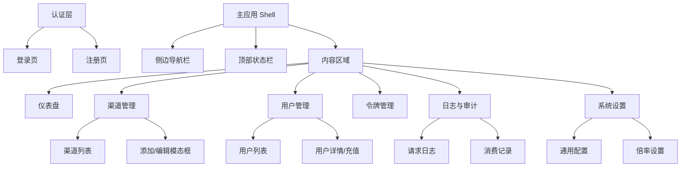

# BurnCloud 界面与交互设计规划 (UI/UX Roadmap)

**最后更新**: 2025-12-07
**设计理念**: Windows 11 Fluent Design (Mica, Acrylic, Depth)
**技术栈**: Dioxus (Rust) + CSS Variables

---

## 1. 界面整体架构 (Sitemap)

---

## 2. 设计系统规范 (Design System)

### 2.1 核心视觉
*   **材质 (Materials)**:
    *   `Mica` (云母色): 应用背景。
    *   `Acrylic` (亚克力): 侧边栏、模态框、下拉菜单。
*   **圆角 (Radius)**:
    *   `--radius-lg` (8px): 卡片、模态框。
    *   `--radius-md` (4px): 按钮、输入框。
*   **阴影 (Elevation)**: 使用深度阴影区分层级，而非简单的边框。

### 2.2 基础组件库 (BurnCloud UI Kit)
需在 `crates/client/crates/client-shared` 中封装：

| 组件名 | 描述 | 状态 |
| :--- | :--- | :--- |
| `BCButton` | 支持 Primary/Secondary/Danger，带 Loading 状态 | ✅ Completed |
| `BCInput` | 统一风格的文本输入框，支持 Label 和 Error 提示 | ✅ Completed |
| `BCCard` | 标准内容容器，带 Header/Body/Footer 插槽 | ✅ Completed |
| `BCModal` | 居中遮罩弹窗，支持 ESC 关闭 | 📅 Pending |
| `BCToast` | 全局消息通知队列 (Success/Error/Info) | ✅ Completed |
| `BCTable` | 支持分页、排序、多选的数据表格 | 📅 Pending |
| `BCBadge` | 状态标签 (Pill shape) | 📅 Pending |

---

## 3. 功能模块详细规划

### 3.1 仪表盘 (Dashboard) - 指挥中心
*   **实时图表**: 引入 Chart.js，展示 24H 内的 RPM (Requests Per Minute) 和 TPM (Tokens Per Minute)。
*   **财务概览**: 今日消耗、本月预估、余额预警。
*   **健康看板**: 渠道健康度统计 (🟢 15 / 🔴 2)。

### 3.2 渠道管理 (Channels) - 核心业务
*   **高级筛选**: 按 ID、类型、分组、状态筛选。
*   **批量操作**: 启用/禁用、删除、改分组。
*   **实时测速**: 点击 "Test" 按钮，异步测试连通性并更新该行状态。
*   **动态表单**: 根据选择的渠道类型 (OpenAI/Azure/Gemini) 动态展示所需的输入字段。

### 3.3 日志与审计 (Logs) - 运维工具
*   **虚拟滚动**: 支持长列表的高性能渲染。
*   **高级搜索**: 按 Request ID、User ID、Status Code 搜索。
*   **详情侧边栏**: 点击日志行，右侧滑出完整 JSON Body (带语法高亮)。

### 3.4 用户与令牌 (Identity)
*   **用户画像**: 头像、余额、所属分组。
*   **充值管理**: 管理员手动充值/扣款。
*   **令牌生成**: 一键生成 `sk-` 开头的 Key，支持设置过期时间和额度。

### 3.5 系统设置 (Settings)
*   **Tab 分页**: 通用 / 运营 / 邮箱 / OAuth。
*   **运营配置**: 设置充值链接、首页公告、邀请返利比例。

---

## 4. 执行路线图 (Execution Plan)

### Phase 1: 基础建设 (Foundation)
1.  **Layout 优化**: 响应式侧边栏，支持移动端折叠。
2.  **Toast 系统**: 实现全局状态管理的消息通知 (✅ Completed).
3.  **Component 封装**: 完成 `BCButton`, `BCInput`, `BCCard` (✅ Completed).

### Phase 2: 核心管理页 (Core CRUD)
1.  **渠道管理重构**: 实现表格筛选、分页、批量操作。
2.  **添加渠道向导**: 步骤条式的添加流程。

### Phase 3: 可视化与高级功能 (Visualization & Pro)
1.  **图表集成**: 实现 Dashboard 流量图。
2.  **日志详情**: 实现 JSON Viewer。

### Phase 4: 移动端适配 (Mobile)
1.  调整 Grid/Flex 布局，确保在手机浏览器上可用。

---
*此文档指导 BurnCloud 前端开发的演进方向。*