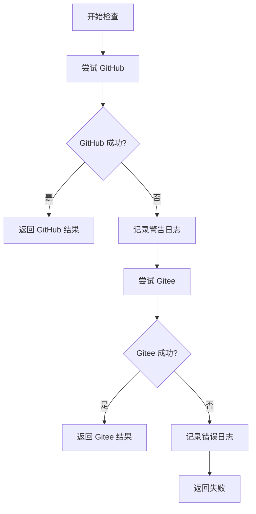
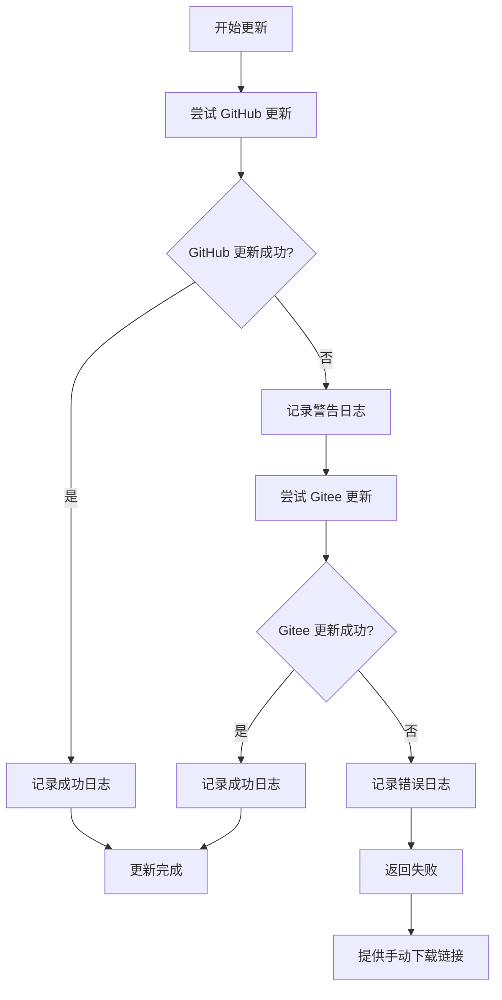

# 自动更新模块设计文档

## 模块概述

自动更新模块是 BurnCloud 项目的核心组件之一，负责提供应用程序的自动更新功能。该模块采用多源回退机制，优先从 GitHub 获取更新，失败时自动回退到 Gitee，确保在不同网络环境下都能正常工作。

## 设计目标

1. **可靠性**: 提供多源回退机制，确保更新服务的高可用性
2. **易用性**: 简单的 API 设计，支持一键更新和检查
3. **灵活性**: 支持自定义配置，适应不同的部署需求
4. **安全性**: 使用官方 self_update crate，确保更新过程的安全性
5. **国际化**: 同时支持 GitHub 和 Gitee，适应不同地区的网络环境

## 架构设计

### 层次结构

```
┌─────────────────────────────┐
│       CLI Commands          │  ← 用户接口层
├─────────────────────────────┤
│      AutoUpdater API        │  ← 业务逻辑层
├─────────────────────────────┤
│    Update Backends          │  ← 后端适配层
│  ┌─────────┐ ┌─────────────┐ │
│  │ GitHub  │ │   Gitee     │ │
│  │Backend  │ │  (S3-like)  │ │
│  └─────────┘ └─────────────┘ │
├─────────────────────────────┤
│      self_update crate      │  ← 底层更新框架
└─────────────────────────────┘
```

### 核心组件

#### 1. UpdateConfig
- 配置管理组件
- 存储仓库信息、版本信息等
- 提供默认配置支持

#### 2. AutoUpdater
- 核心更新逻辑
- 实现回退机制
- 提供统一的更新接口

#### 3. Update Backends
- GitHub Backend: 使用官方 GitHub API
- Gitee Backend: 使用 S3-like 接口模拟

## 设计模式

### 1. 策略模式 (Strategy Pattern)
通过不同的 Backend 实现不同的更新策略：
- `github::Update`: GitHub 更新策略
- `s3::Update`: Gitee(S3-like) 更新策略

### 2. 回退模式 (Fallback Pattern)
当主要更新源失败时，自动切换到备用源：
```
GitHub (Primary) --失败--> Gitee (Fallback)
```

### 3. 建造者模式 (Builder Pattern)
使用 self_update crate 的建造者模式配置更新器：
```rust
github::Update::configure()
    .repo_owner("burncloud")
    .repo_name("burncloud")
    .bin_name("burncloud")
    .current_version("1.0.0")
    .build()?
```

## 技术选型

### 核心依赖

1. **self_update (0.40)**
   - 成熟的 Rust 自动更新库
   - 支持多种后端 (GitHub, S3, 等)
   - 内置安全性检查

2. **anyhow (1.0)**
   - 统一错误处理
   - 简化错误传播

3. **log (0.4)**
   - 标准日志记录
   - 便于调试和监控

4. **tokio**
   - 异步运行时支持
   - 提高网络操作性能

### 后端选择

#### GitHub Backend
- **优势**:
  - 官方支持，稳定性高
  - 全球 CDN 加速
  - 丰富的 API 功能
- **劣势**:
  - 国内访问可能不稳定
  - 需要处理 API 限制

#### Gitee Backend (S3-like)
- **优势**:
  - 国内访问速度快
  - 作为可靠的回退选项
- **劣势**:
  - 需要使用 S3 接口模拟
  - API 功能相对有限

## 实现细节

### 版本检查流程



### 更新执行流程



## 配置管理

### 默认配置
```rust
UpdateConfig {
    github_owner: "burncloud",
    github_repo: "burncloud",
    gitee_owner: "burncloud",
    gitee_repo: "burncloud",
    bin_name: "burncloud",
    current_version: env!("CARGO_PKG_VERSION"),
}
```

### 自定义配置
支持运行时修改配置，适应不同的部署环境。

## 错误处理策略

### 错误分类
1. **网络错误**: 连接超时、DNS 解析失败等
2. **认证错误**: API 密钥无效、权限不足等
3. **版本错误**: 版本格式错误、找不到对应版本等
4. **系统错误**: 文件权限不足、磁盘空间不足等

### 处理策略
1. **网络错误**: 自动重试 + 回退机制
2. **认证错误**: 记录错误，提示用户检查配置
3. **版本错误**: 详细错误信息，帮助用户排查
4. **系统错误**: 提供具体的解决建议

## 安全考虑

### 1. 签名验证
依赖 self_update crate 的内置签名验证机制。

### 2. HTTPS 强制
所有网络请求强制使用 HTTPS。

### 3. 版本校验
严格的版本号格式检查和比较。

### 4. 权限检查
更新前检查文件写入权限。

## 性能优化

### 1. 异步操作
所有网络操作使用异步 I/O，避免阻塞。

### 2. 连接复用
复用 HTTP 连接，减少握手开销。

### 3. 增量更新
未来可考虑支持增量更新，减少下载量。

## 测试策略

### 单元测试
- 配置管理测试
- 版本比较逻辑测试
- 错误处理测试

### 集成测试
- GitHub 后端集成测试
- Gitee 后端集成测试
- 回退机制测试

### 手动测试
- 不同网络环境测试
- 不同操作系统测试
- 边界条件测试

## 监控和日志

### 日志等级
- `INFO`: 正常操作流程
- `WARN`: 回退操作、非致命错误
- `ERROR`: 严重错误、更新失败

### 关键指标
- 更新成功率
- 各后端使用率
- 平均更新时间

## 未来扩展

### 1. 更多后端支持
- 企业内部源
- 其他代码托管平台

### 2. 增量更新
- 二进制差分更新
- 节约带宽和时间

### 3. 自动更新调度
- 定时检查更新
- 用户可配置更新策略

### 4. 回滚支持
- 支持版本回滚
- 自动备份旧版本

## 总结

自动更新模块通过多源回退机制、简洁的 API 设计和完善的错误处理，为 BurnCloud 提供了可靠的自动更新能力。模块设计充分考虑了国内外网络环境的差异，确保在各种环境下都能正常工作。

通过使用成熟的 self_update crate 作为底层实现，既保证了功能的完整性，又确保了安全性。同时，模块的可扩展设计为未来的功能增强预留了空间。