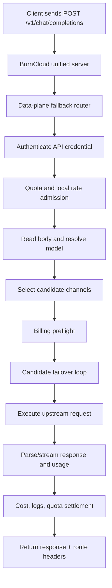
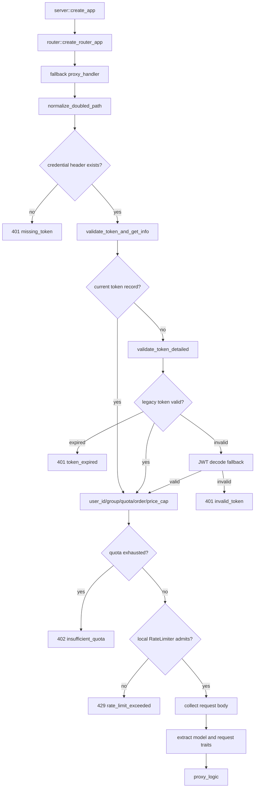
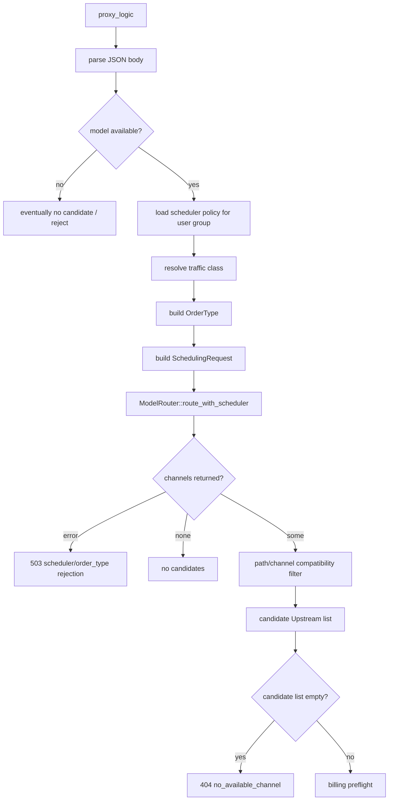
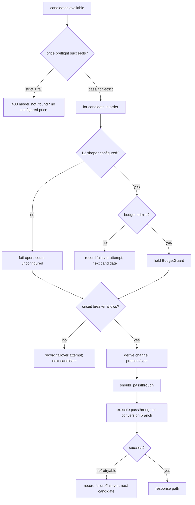
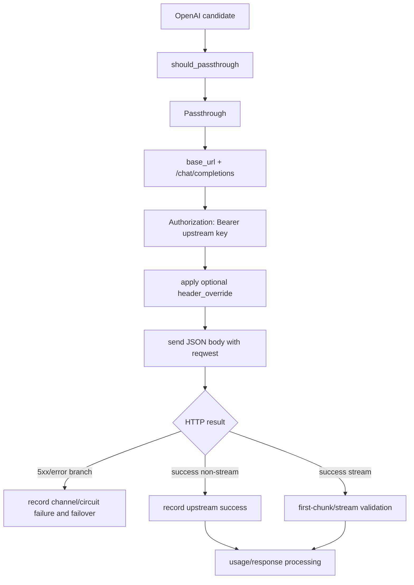
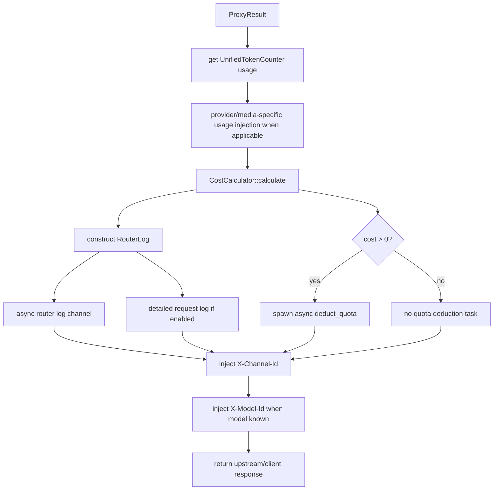

# Chat Completions Runtime Flow

## User action

A client sends an OpenAI-compatible request:

`POST /v1/chat/completions`

with an API credential, a JSON body containing `model`, and chat messages.

This document follows that request from unified server entry to admission, model routing, upstream execution, response processing, billing/logging, and the final client response.

## Scope

Included:

- unified server fallback entry;
- path normalization;
- API credential resolution and token validation;
- quota and local rate admission;
- request buffering/model extraction;
- scheduler/candidate selection;
- path/channel compatibility filtering;
- billing preflight;
- per-candidate shaper/circuit checks;
- OpenAI passthrough branch;
- failover state relevant to the request;
- usage/cost/log/quota settlement;
- route-tracing response headers.

Not fully expanded here:

- internals of scheduler scoring and affinity ranking;
- every provider conversion adaptor;
- every streaming parser branch;
- database SQL implementation details.

Those are separate drill-down flows when they become necessary.

---

# L0 — User Journey

All major edges above are **STATIC CONFIRMED** at the responsibility level. The exact candidate and some downstream execution branches are **DYNAMIC** because database state, user group/order type, health, scheduler policy, channel configuration, and request fields participate in selection.

---

# L1 — Entry and Admission ICFG

## Entry evidence

- `crates/server/src/lib.rs :: create_app` composes the data-plane router into the unified Axum application as fallback.
- `crates/router/src/lib.rs :: create_router_app` registers a few explicit data-plane routes and installs `fallback(proxy_handler)` for unmatched data-plane requests.
- Therefore `POST /v1/chat/completions` enters through `proxy_handler`; it does not require a dedicated Axum `.route()` registration.

Classification: **STATIC CONFIRMED**.

## Path normalization

`proxy_handler` normalizes doubled client-SDK paths before routing. For example, duplicated `/v1/chat/completions/v1/chat/completions` can collapse to the canonical endpoint.

Evidence:

- `crates/router/src/lib.rs :: normalize_doubled_path`
- `crates/router/src/lib.rs :: proxy_handler`

Classification: **STATIC CONFIRMED**.

## Credential resolution

The fallback accepts the first available credential from:

1. `Authorization: Bearer ...`
2. `x-api-key`
3. `x-goog-api-key`

Missing credentials return HTTP 401 before body routing.

Evidence:

- `crates/router/src/lib.rs :: proxy_handler`

Classification: **STATIC CONFIRMED**.

## Token validation chain

The current chain is:

1. `RouterDatabase::validate_token_and_get_info`
2. if absent, `RouterDatabase::validate_token_detailed`
3. if legacy validation reports invalid, JWT decode fallback

The successful result feeds user id, user group, quota fields, order type, and optional price cap into later routing/admission decisions.

Classification: **STATIC CONFIRMED** for the branch structure; database contents are **DYNAMIC**.

## Admission gates

Before calling `proxy_logic`, the handler rejects:

- exhausted quota with HTTP 402;
- local per-user rate limiting with HTTP 429;
- unreadable request body with HTTP 400.

Classification: **STATIC CONFIRMED**.

---

# L2 — Model Routing and Candidate Construction

## Request-derived routing inputs

For this flow, `proxy_handler` extracts `model` from the JSON body before calling `proxy_logic`. `proxy_logic` also computes:

- estimated TPM from `max_tokens`, with a 4096 fallback;
- session id from `conversation_id`, falling back to `user_id`;
- traffic class via `UserService::resolve_traffic_class`;
- `OrderType` from token/order database fields.

Classification: **STATIC CONFIRMED** for computation rules; values are **DYNAMIC**.

## Scheduler selection

`proxy_logic` reads the scheduler policy keyed by the lower-cased user group and calls:

`crates/router/src/model_router.rs :: ModelRouter::route_with_scheduler`

with group, model, channel health state, pricing/exchange information, scheduler kind, request classification, and affinity cache.

The exact ordered channel result is **DYNAMIC**.

## Critical OpenAI-path filter

After `route_with_scheduler` returns channel records, the current code applies an additional path/channel compatibility filter.

For paths beginning with:

- `/v1/chat/completions`
- `/v1/completions`
- `/v1/embeddings`

only channels mapped to `ChannelType::OpenAI` or `ChannelType::Zai` survive candidate construction.

This means the candidate list used by the current `/v1/chat/completions` path is narrower than the raw result returned by the model router.

Evidence:

- `crates/router/src/lib.rs :: proxy_logic`
- `crates/common/src/types.rs :: ChannelType`

Classification: **STATIC CONFIRMED**.

## No-candidate exits

There are two materially different local rejection families:

- scheduler/order-type routing error: HTTP 503 with `X-Rejected-By` and `Retry-After`;
- candidate list empty after routing/filtering: HTTP 404 `no_available_channel`.

Do not collapse these into one generic routing error in clients or observability.

---

# L3 — Billing Preflight and Candidate Failover Loop

## Billing preflight

When `model_name` is known, `proxy_logic` runs the cost calculator preflight before external execution.

- strict mode is enabled by default unless `BILLING_STRICT_MODE` is false/0;
- in strict mode, missing/unsupported pricing rejects the request before the upstream call;
- non-strict mode logs and allows the request.

Evidence:

- `crates/router/src/lib.rs :: create_router_app`
- `crates/router/src/lib.rs :: proxy_logic`

Classification: **STATIC CONFIRMED** for behavior; configured pricing is **DYNAMIC**.

## Per-candidate local controls

Each candidate passes through local controls before an upstream HTTP request:

1. L2 rate-budget/shaper admission;
2. circuit-breaker admission;
3. protocol/adaptor branch selection.

The shaper may reject one candidate and continue to the next. An unconfigured shaper channel currently fails open and increments observability state.

Classification: **STATIC CONFIRMED**.

## Failover

The loop iterates ordered candidates. Later attempts update the routing decision to `Failover { attempt }`, and rejected/failed attempts can be recorded into detailed request-log data.

The exact number and identity of attempts are **DYNAMIC**.

---

# L4 — OpenAI Upstream Execution Branch

For the current `/v1/chat/completions` flow, an OpenAI channel survives the path filter and `should_passthrough` returns passthrough for the OpenAI-native chat path.

Evidence:

- `crates/router/src/passthrough.rs :: should_passthrough`
- `crates/router/src/lib.rs :: proxy_logic`

Classification: **STATIC CONFIRMED** for the OpenAI-channel branch.

## Important dynamic boundary

Do not generalize the OpenAI passthrough branch into a universal provider call graph.

`proxy_logic` contains both passthrough and conversion execution paths, and runtime channel/protocol data determines the applicable branch. A provider-specific runtime document must prove its candidate eligibility and adaptor target independently.

---

# L5 — Response, Usage, Billing, Logging, Quota

After `proxy_logic` returns, `proxy_handler` performs post-execution settlement and observability.

## Cost calculation

The handler reads unified usage collected while processing the response and calculates cost when usage is non-empty and a model is known.

A missing price after execution is recorded as a billing status/counter and can yield zero recorded cost; it is distinct from the strict preflight rejection path.

Classification: **STATIC CONFIRMED**.

## Logging

Two logging paths exist:

- `RouterLog` is sent through an async channel for database insertion;
- detailed `RouterRequestLog` is emitted when request-log storage policy is not `none`.

Request logging code sanitizes sensitive headers/body fields and can truncate large bodies.

Classification: **STATIC CONFIRMED**.

## Quota settlement

When calculated `cost > 0`, quota deduction is spawned asynchronously using the authenticated user/token.

This is a **fire-and-forget side effect** relative to the client response path; document changes to it carefully because request success and accounting persistence are not the same atomic operation.

Evidence:

- `crates/router/src/lib.rs :: proxy_handler`

Classification: **STATIC CONFIRMED**.

## Client-visible route evidence

If an upstream channel id exists, the response receives:

- `X-Channel-Id`
- `X-Model-Id` when model is known

before returning to the client.

Classification: **STATIC CONFIRMED**.

---

# Decision Table

| Decision | Condition | Result | Classification | Evidence |
|---|---|---|---|---|
| Data-plane entry | unmatched route such as `/v1/chat/completions` | `proxy_handler` | STATIC CONFIRMED | `crates/router/src/lib.rs :: create_router_app` |
| Credential source | bearer / x-api-key / x-goog-api-key | token string or 401 | STATIC CONFIRMED | `crates/router/src/lib.rs :: proxy_handler` |
| Token source | current token row / legacy token / JWT fallback | user routing context or auth error | DYNAMIC branch input | `crates/router/src/lib.rs :: proxy_handler` |
| Quota admission | quota exhausted | 402 | STATIC CONFIRMED | `crates/router/src/lib.rs :: proxy_handler` |
| Local rate admission | limiter rejects | 429 | STATIC CONFIRMED | `crates/router/src/lib.rs :: proxy_handler` |
| Scheduler result | group/model/health/pricing/order/affinity | ordered channels or 503 | DYNAMIC | `crates/router/src/model_router.rs :: route_with_scheduler` |
| OpenAI path compatibility | `/v1/chat/completions` | only OpenAI/Zai candidates survive | STATIC CONFIRMED | `crates/router/src/lib.rs :: proxy_logic` |
| Price preflight | price missing + strict mode | 400 before upstream | DYNAMIC data, STATIC rule | `crates/router/src/lib.rs :: proxy_logic` |
| Shaper | configured budget rejects | try next candidate | DYNAMIC state, STATIC rule | `crates/router/src/lib.rs :: proxy_logic` |
| Circuit breaker | circuit open | try next candidate | DYNAMIC state, STATIC rule | `crates/router/src/lib.rs :: proxy_logic` |
| OpenAI execution | OpenAI candidate + chat path | passthrough to `/chat/completions` | STATIC CONFIRMED | `crates/router/src/passthrough.rs :: should_passthrough`; `proxy_logic` |
| Quota deduction | calculated cost > 0 | async deduction task | STATIC CONFIRMED | `crates/router/src/lib.rs :: proxy_handler` |

---

# State and Side Effects

Current flow can touch or depend on:

- router token/user-group/quota data;
- token `accessed_time` update task;
- scheduler policy state;
- channel health state;
- affinity cache;
- rate-budget/shaper state;
- circuit breaker state;
- external provider HTTP request;
- token/usage counters;
- price cache/cost calculator;
- router log database writer;
- detailed request log writer;
- async quota deduction.

Not every request mutates every item; many branches are conditional.

---

# Failure Exits to Preserve

At minimum, changes in this flow must consider these distinct exits:

- 401 missing credential;
- 401 expired/invalid credential;
- 402 insufficient quota;
- 429 local rate limit;
- 400 invalid body/read failure;
- 503 scheduler/order-type local rejection;
- 404 no candidate after filtering;
- 400 strict billing preflight rejection;
- candidate-level shaper rejection and failover;
- circuit-open candidate skip and failover;
- upstream HTTP/server/network error;
- streaming first-chunk/empty-response failure;
- post-response billing/logging failure that may not change the already-produced upstream response.

Do not change one of these branches by editing a nearby success path without verifying its state effects.

---

# Executable Evidence

Primary integration evidence:

- `crates/tests/tests/api/relay.rs :: test_e2e_real_upstream`
  - creates an OpenAI channel;
  - calls `/v1/chat/completions`;
  - expects an upstream-compatible `choices` response.

Additional routing/provider/billing tests should be selected using `docs/agent/TEST_MATRIX.md` when changing a deeper branch.

---

# Verification Gap — Gemini Relay Test vs Current Path Filter

`crates/tests/tests/api/relay.rs :: test_gemini_adaptor` creates channel type `24` (Gemini) and calls `/v1/chat/completions`.

However, the current `proxy_logic` path compatibility filter allows `/v1/chat/completions` candidates only when `ChannelType` is `OpenAI` or `Zai`, and `ChannelType::Gemini` is value `24`.

Therefore the test intent and the inspected routing branch appear inconsistent.

This is recorded as a **verification gap**, not resolved by this document.

Important detail: the Gemini integration test exits early when `TEST_GEMINI_KEY` is unavailable, so its presence alone does not prove the current path succeeds in normal CI.

To resolve the gap, use a targeted test with a deterministic/mock Gemini channel or explicitly decide whether OpenAI-format-to-Gemini conversion should remain supported. Then change source/tests/docs together.

---

# Source Evidence Index

- `crates/server/src/lib.rs :: create_app`
- `crates/router/src/lib.rs :: create_router_app`
- `crates/router/src/lib.rs :: normalize_doubled_path`
- `crates/router/src/lib.rs :: proxy_handler`
- `crates/router/src/lib.rs :: proxy_logic`
- `crates/router/src/model_router.rs :: ModelRouter::route_with_scheduler`
- `crates/router/src/passthrough.rs :: should_passthrough`
- `crates/common/src/types.rs :: ChannelType`
- `crates/tests/tests/api/relay.rs :: test_e2e_real_upstream`
- `crates/tests/tests/api/relay.rs :: test_gemini_adaptor`

---

# Maintenance Trigger

Update this document in the same PR when a change modifies:

- `/v1/chat/completions` entry behavior;
- credential/token/quota admission;
- scheduler inputs or candidate filtering;
- OpenAI/Zai eligibility for the path;
- provider/adaptor selection;
- shaper/circuit/failover semantics;
- billing preflight or settlement;
- request/router logging;
- quota deduction;
- client-visible route tracing headers.
