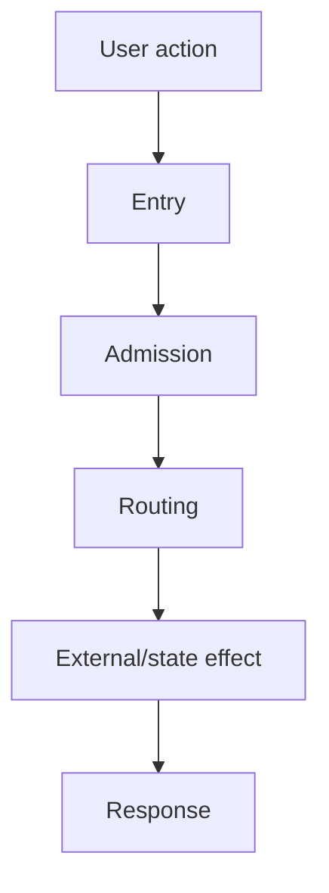

# Runtime Flow Template

Use this template for repository-local End-to-End Request Flow + drill-down ICFG documentation.

The goal is not to draw every function. The goal is to let a human or coding agent move from a user action to the exact source that controls the behavior.

## 1. User action

State one concrete behavior.

Example:

`User sends POST /v1/chat/completions with an API token and a model.`

## 2. Scope

Document:

- what starts the flow;
- what successful completion means;
- major rejection/failure exits;
- persistent/external side effects;
- what is intentionally outside this flow.

Do not mix multiple independent user journeys into one document.

## 3. End-to-end flow

Use a small Mermaid graph. Nodes should represent runtime responsibilities, not filenames.

Every node must be backed by source evidence below.

## 4. Execution classification

Classify each important edge:

- **STATIC CONFIRMED** — current source/tests directly prove the edge.
- **DYNAMIC** — runtime data/configuration selects the target or branch.
- **INFERRED** — likely, but the inspected source does not fully prove it.

Never use a straight arrow to imply a fixed target when the code performs dynamic dispatch or data-driven selection.

## 5. Progressive drill-down

Start at the entrypoint, then expand only high-value nodes.

Recommended levels:

1. **L0 — User journey**
2. **L1 — End-to-end runtime flow**
3. **L2 — Entry/admission ICFG**
4. **L3 — Routing/provider ICFG**
5. **L4 — Persistence/billing/observability ICFG**
6. **L5 — Source evidence**

Avoid repository-wide call graphs.

## 6. Decision table

Use a table for branches that matter to correctness.

| Decision | Condition | Result | Classification | Evidence |
|---|---|---|---|---|
| Example | runtime condition | next behavior | STATIC/DYNAMIC/INFERRED | `path :: Symbol` |

## 7. State and side effects

Explicitly list:

- database reads/writes;
- caches/affinity/circuit state;
- async logging;
- quota/billing effects;
- external HTTP calls;
- response headers/status/body effects.

If a side effect is fire-and-forget, say so.

## 8. Failure exits

Document important exits such as:

- authentication failure;
- quota/rate rejection;
- no route/candidate;
- local shaper/scheduler rejection;
- upstream HTTP/network error;
- streaming first-chunk failure;
- billing/price failure.

Do not collapse different failures into one generic "error" node when they produce different state changes or client contracts.

## 9. Source evidence

Prefer stable symbol references:

- `path/to/file.rs :: SymbolName`
- `path/to/test.rs :: test_name`

Source is authoritative. Tests are executable evidence but may be conditional, skipped, stale, or incomplete; call that out when relevant.

## 10. Verification gaps

Create a short section whenever source/tests/docs disagree or an important runtime branch cannot be proven statically.

A verification gap is not permission to guess. Record:

- what is uncertain;
- why it is uncertain;
- what test/trace/source inspection would resolve it.

## 11. Maintenance trigger

Update the flow when a change modifies any of these:

- entry/routing;
- authentication/admission;
- candidate selection/scheduling;
- provider/adaptor dispatch;
- failover/circuit/affinity behavior;
- billing/quota/accounting;
- persistence/logging;
- client-visible status/body/headers.
